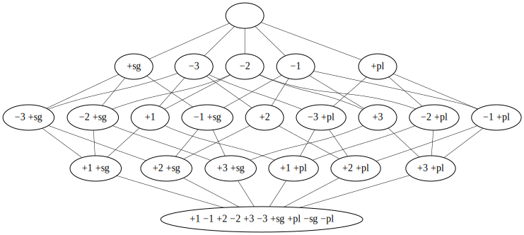

.. _advanced:

Advanced Usage
==============

Visualization
-------------

Create a graph of the feature system lattice.

.. code:: python

    >>> import features

    >>> fs = features.FeatureSystem('plural')

    >>> dot = fs.graphviz()

    >>> print(dot.source)  # doctest: +ELLIPSIS, +NORMALIZE_WHITESPACE
    // <FeatureSystem('plural') of 6 atoms 22 featuresets>
    digraph plural {
    	graph [margin=0]
    	edge [arrowtail=none dir=back penwidth=.5]
    		f0 [label="+1 &minus;1 +2 &minus;2 +3 &minus;3 +sg +pl &minus;sg &minus;pl"]
    		f1 [label="+1 +sg"]
    			f1 -> f0
    		f2 [label="+1 +pl"]
    			f2 -> f0
    ...

Check the documentation_ of the `Python graphviz interface`_ used for details
on the resulting object.

Customization
-------------

To customize the behavior of the feature sets, override the
:attr:`~.FeatureSystem.FeatureSet` class-attribute of :class:`.FeatureSystem`
with a subclass that implements your wanted features:

.. code:: python

    >>> class MyFeatures(features.FeatureSystem.FeatureSet):
    ...     @property
    ...     def features(self):
    ...         return list(self.concept.intent)

    >>> class MyFeatureSystem(features.FeatureSystem):
    ...     FeatureSet = MyFeatures

    >>> myfs = MyFeatureSystem('small')

    >>> myfs('1 -pl')
    MyFeatures('+1 -pl')

    >>> myfs('1 -pl').features
    ['+1', '-2', '-pl']

.. _documentation: https://graphviz.readthedocs.io
.. _Python graphviz interface: https://pypi.org/project/graphviz/
